# 🛡️ LanSentry - Intelligent LAN Asset Catalog & Pi-hole v6 Sentinel

[](LICENSE)
[](docker-compose.prod.yml)
[](https://www.postgresql.org)
[](https://pi-hole.net)
[](https://alpinelinux.org)

Catálogo inteligente de dispositivos em rede local (Layer 2 ARP), monitoramento de presença e uptime, enriquecimento automatizado de fabricantes (OUI + fallback `api.macvendors.com`), sinergia bidirecional com **Pi-hole v6 + Unbound**, bloqueio sob demanda com toggle visual e alertas push com links diretos via **ntfy**.

---

## 🏗️ Arquitetura do Sistema

```mermaid
flowchart TD
    subgraph LAN["Rede Local (LAN 192.168.1.0/24)"]
        Devices["Dispositivos (IoT, Celulares, PCs, TV, Roteadores)"]
    end

    subgraph AlpineHost["Raspberry Pi / Servidor Alpine (192.168.1.7)"]
        WYL["lansentry-wyl (Porta 8841)<br/>• Scanner ARP Layer 2 em eth0<br/>• Engine WatchYourLAN v2"]
        PG["PostgreSQL 15 (postgres_db)<br/>• Persistência relacional em 5432<br/>• Tabela 'now' com IP, MAC, HW, Name"]
        Sidecar["lansentry-sidecar (Porta 8840)<br/>• Proxy Transparente HTTP<br/>• Injetor custom.js no Frontend<br/>• Auto-Enricher (OUI + API macvendors + PTR)<br/>• Sincronizador de Grupos Pi-hole<br/>• FTL Hostname Injector"]
        
        subgraph PiHoleStack["Pi-hole v6 + Unbound"]
            Gravity["/etc/pihole/gravity.db<br/>(Grupos 0 a 7 & Regra Coringa '.*')"]
            FTL["/etc/pihole/pihole-FTL.db<br/>(Query Log & Hostnames network_addresses)"]
        end

        Pendrive["Pendrive USB (/mnt/pendrive_cinza)<br/>• Arquivos do projeto e dados<br/>• Backup diário comprimido (Cron 03:45)"]
    end

    subgraph CloudMobile["Alertas & Controle"]
        Ntfy["ntfy.sh/bruno-casa-dallas<br/>• Alertas com link direto /#/host/:id"]
        Browser["Navegador Web<br/>• http://192.168.1.7:8840"]
    end

    Devices -->|ARP Broadcast| WYL
    WYL -->|Grava Descobertas| PG
    PG <-->|Lê/Atualiza Nomes e Status| Sidecar
    Sidecar <-->|Lê/Grava Grupos| Gravity
    Sidecar -->|Injeta Nomes Humanos| FTL
    Sidecar -->|Dispara Alertas Push| Ntfy
    Sidecar -->|Serve Dashboard Enriquecido| Browser
    Browser -->|Toggles e Seletor de Grupos| Sidecar
    PG -.->|Dumps| Pendrive
    Gravity -.->|Snapshots| Pendrive
```



---

## ✨ Principais Funcionalidades

### 1. Descoberta e Presença em Tempo Real (Camada 2)
- Escaneia a rede física via ARP na interface (`eth0`) sem depender do servidor DHCP.
- Detecta novos aparelhos no momento exato em que entram na rede.
- Histórico completo de primeiro visto, última atividade e uptime.

### 2. Auto-Enricher de Nomes e Fabricantes
- **Resolução de Fabricante:** Base OUI local combinada com fallback automático na API `api.macvendors.com` com cache e controle de taxa.
- **Resolução Reversa de DNS (PTR):** Consulta o Unbound/Pi-hole local para nomes existentes na rede (`.lan`).
- **Nomes Amigáveis Automáticos:** Dispositivos sem nome são classificados com nomes claros (ex: `Tuya Smart Device (66)`, `Midea Ar-Condicionado`, `Amazon Echo / Alexa`, `Peixe (Raspberry Pi)`).

### 3. Sinergia Total com Pi-hole v6
- **Visualização de Grupos:** A tabela principal exibe badges coloridos para cada política de filtragem (`Infraestrutura`, `IoT & Smart Home`, `Assistentes & Streaming`, `Dispositivos Móveis`, `Workstations & PCs`, `Kids & Família`, `Default`, `Bloqueado`).
- **Seletor de Grupos no Host (`/#/host/:id`):** Altere a qual grupo do Pi-hole o dispositivo pertence diretamente pela interface do LanSentry.
- **Auto-Classificação de Novos Aparelhos:** Aparelhos novos são associados automaticamente ao seu grupo ideal (ex: Tuya/ESP ➔ IoT, Alexa ➔ Streaming).
- **Fim dos IPs Anônimos no Query Log:** O LanSentry sincroniza os nomes dos aparelhos na tabela `network_addresses` do Pi-hole FTL. Ao consultar o Pi-hole, você vê exatamente o nome de cada cliente!

### 4. Bloqueio sob Demanda ("Allow by Default")
- **Política Segura:** Novos aparelhos **nunca** são bloqueados automaticamente.
- **Toggle Instantâneo:** Chave visual na tabela e na tela do host para revogar acesso instantaneamente via grupo `LANSENTRY_BLOCKED` (regex `.*`).

### 5. Notificações Push com Link Direto (ntfy)
- Notificações ricas no canal `bruno-casa-dallas`.
- O botão de ação e o clique na notificação abrem diretamente a página de edição do host específico (`http://192.168.1.7:8840/#/host/<ID>`).

### 6. Backups Automatizados no Pendrive USB
- Script com retenção de 14 dias: `/mnt/pendrive_cinza/14_LanSentry/scripts/backup_lansentry.sh`.
- Salva `pg_dump` comprimido do PostgreSQL e snapshot atômico do `gravity.db` do Pi-hole.
- Agendado no crontab do sistema para rodar todas as madrugadas às **03:45 AM**.

---

## 📁 Estrutura do Repositório

```text
LanSentry/
├── docker-compose.yml          # Ambiente de desenvolvimento local
├── docker-compose.prod.yml     # Orquestração de produção (Raspberry Pi Alpine)
├── .env.example                # Modelo de configuração de variáveis
├── requirements.txt            # Dependências Python (sidecar & graphify)
├── README.md                   # Documentação do projeto
├── ROADMAP.md                  # Planejamento e próximas entregas
├── .gemini/
│   └── skills/
│       └── lansentry/
│           └── SKILL.md        # Skill autônoma do agente LanSentry
├── graphify-out/               # Grafo de conhecimento gerado via graphifyy
│   ├── graph.html              # Visualização interativa do grafo da arquitetura
│   ├── graph.json              # Grafo em JSON para agentes
│   └── GRAPH_REPORT.md         # Relatório estrutural de nós e comunidades
├── scripts/
│   └── backup_lansentry.sh     # Script de backup automatizado para o pendrive
└── sidecar/
    ├── Dockerfile              # Imagem do container Sidecar
    ├── requirements.txt        # Dependências do container
    ├── sidecar.py              # Proxy reverso, Auto-Enricher, API e Sync Pi-hole
    └── custom.js               # Injeção dinâmica no frontend (Toggles e Grupos)
```

---

## 🚀 Como Executar

### Em Ambiente de Produção (Raspberry Pi / Alpine Linux)

1. Clone o repositório no destino desejado (preferencialmente no pendrive montado):
   ```bash
   cd /mnt/pendrive_cinza
   git clone git@github.com:brunocorisco86/LanSentry.git 14_LanSentry
   cd 14_LanSentry
   ```

2. Crie o arquivo `.env` de produção:
   ```bash
   cp .env.example .env
   # Ajuste as credenciais do PostgreSQL, portas e caminhos do Pi-hole
   ```

3. Inicie os containers:
   ```bash
   docker compose -f docker-compose.prod.yml up -d --build
   ```

4. Acesse o painel:
   👉 **`http://192.168.1.7:8840`**

---

### Em Ambiente Local de Desenvolvimento (Pop!_OS / Ubuntu)

1. Clone e configure as variáveis:
   ```bash
   git clone git@github.com:brunocorisco86/LanSentry.git
   cd LanSentry
   cp .env.example .env
   ```

2. Inicie a stack de desenvolvimento:
   ```bash
   docker compose up -d --build
   ```

3. Acesse em:
   👉 **`http://localhost:8840`**

---

## 🧠 Grafo de Conhecimento (Graphify)

O projeto possui um grafo navegável de arquitetura mantido via `graphifyy`. Para inspecionar visualmente ou atualizar:

```bash
# Atualizar extração AST e clustering
python3 -m graphify . --code-only
python3 -m graphify cluster-only .

# Abrir visualização interativa
xdg-open graphify-out/graph.html
```

---

## 📄 Licença

Distribuído sob a licença MIT. Consulte `LICENSE` para mais detalhes.
